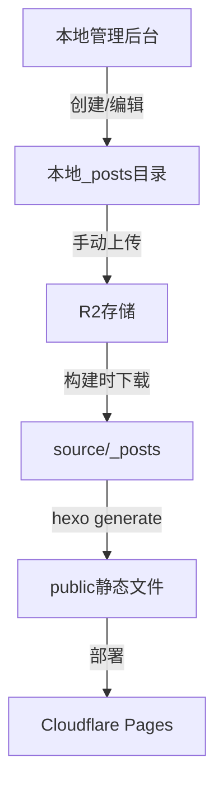
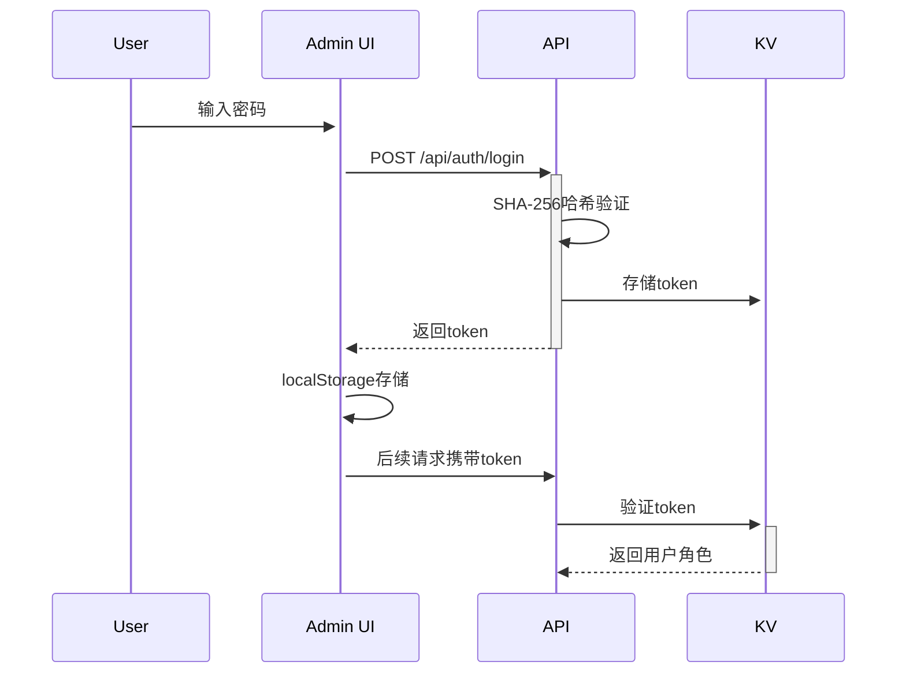

# 项目架构说明

## 技术栈

### 核心框架

- **Hexo 8.x** - 静态博客生成器
- **Solitude 主题** - 现代化博客主题

### 后端

- **Cloudflare Pages** - 静态网站托管
- **Cloudflare Functions** - 无服务器API
- **Cloudflare KV** - 键值存储
- **Cloudflare R2** - 对象存储(S3兼容)

### 本地开发

- **Express 5.x** - 本地管理后台
- **EasyMDE** - Markdown编辑器
- **Vue 3** - 管理界面框架

### 开发工具

- **nodemon** - 自动重启
- **ESLint** - 代码检查
- **Prettier** - 代码格式化
- **dotenv** - 环境变量管理

---

## 目录结构

```
blog/
├── source/              # 源文件
│   ├── _posts/         # 文章Markdown文件
│   └── img/            # 图片资源
├── public/             # 生成的静态文件(不提交)
├── functions/          # Cloudflare Functions
│   ├── admin/         # 管理后台API
│   │   ├── index.js   # 文章列表
│   │   ├── editor.js  # 文章编辑器
│   │   └── login.js   # 登录页(旧)
│   └── api/           # 公开API
│       ├── auth/      # 认证
│       ├── posts/     # 文章操作
│       └── rebuild/   # 触发构建
├── admin/              # 本地管理后台
│   ├── server.js      # Express服务器
│   └── static/        # 静态资源
├── scripts/            # 构建脚本
│   └── download-r2-posts.js  # 从R2下载文章
├── .env.example       # 环境变量模板
└── package.json       # 项目配置
```

---

## 数据流程

### 文章发布流程



### 管理后台认证



---

## 核心组件

### 1. 静态生成 (Hexo)

**职责:** 将Markdown转换为HTML  
**配置:** `_config.yml`, `_config.solitude.yml`

### 2. 管理后台 (Functions + Express)

**Cloudflare Functions:**

- `/admin` - 文章管理界面
- `/admin/editor` - Markdown编辑器
- `/api/*` - RESTful API

**本地Express:**

- `npm run admin` - 本地开发服务器
- 端口: 3000 (可通过环境变量配置)

### 3. 存储层

**KV存储:**

- 认证token
- 统计数据

**R2存储:**

- 文章Markdown源文件
- 图片资源

---

## API设计

### 认证

```
POST /api/auth/login
Body: { password: string }
Response: { success: boolean, token: string }
```

### 文章管理

```
GET  /api/posts           # 列表
GET  /api/posts/:id       # 详情
POST /api/posts/create    # 创建
PUT  /api/posts/:id       # 更新
DELETE /api/posts/:id     # 删除
```

### 构建

```
POST /api/rebuild         # 触发Cloudflare构建
```

---

## 环境变量

参考 `.env.example`:

- `R2_*` - R2存储配置
- `ADMIN_PASSWORD_HASH` - 管理员密码哈希
- `PORT` - 本地服务器端口

---

## 安全机制

1. **密码哈希:** SHA-256
2. **Token存储:** KV (1小时过期)
3. **CORS保护:** 限制来源域
4. **环境变量:** 敏感信息不入库

---

## 部署流程

1. 代码推送到GitHub
2. Cloudflare自动拉取
3. 执行 `npm run build`
4. 部署到Pages
5. Functions自动更新

---

## 配置文件说明

### \_config.yml (Hexo主配置)

Hexo框架的核心配置文件，包含以下关键设置:

**站点信息**

```yaml
title: 博客标题
author: 作者名
language: zh-CN
url: https://your-blog.pages.dev
```

**构建配置**

```yaml
permalink: :year/:month/:day/:title/ # URL格式
per_page: 10 # 每页文章数
theme: solitude # 使用的主题
```

**插件配置**

```yaml
# 搜索功能
search:
  path: search.xml
  field: post

# RSS订阅
feed:
  type: atom
  path: atom.xml

# 性能优化
minify:
  html/css/js: enable: true  # 代码压缩
```

### \_config.solitude.yml (主题配置)

Solitude主题的专属配置文件(~1000行)，主要配置:

**基础设置**

- 站点名称、图标
- 导航菜单
- 侧边栏

**功能模块**

- 评论系统（使用 Twikoo）
- 搜索功能
- 社交链接
- 文章推荐

**外观样式**

- 主题色
- 字体
- 布局样式
- 动画效果

**详细配置:** 参考 [Solitude主题文档](https://docs.solitude.js.org/)

---

## 常见配置修改

| 需求           | 修改文件               | 配置项     |
| -------------- | ---------------------- | ---------- |
| 修改博客标题   | `_config.yml`          | `title`    |
| 修改站点URL    | `_config.yml`          | `url`      |
| 修改导航菜单   | `_config.solitude.yml` | `nav.menu` |
| 修改主题颜色   | `_config.solitude.yml` | `theme`    |
| 启用评论       | `_config.solitude.yml` | `comment`  |
| 修改每页文章数 | `_config.yml`          | `per_page` |
